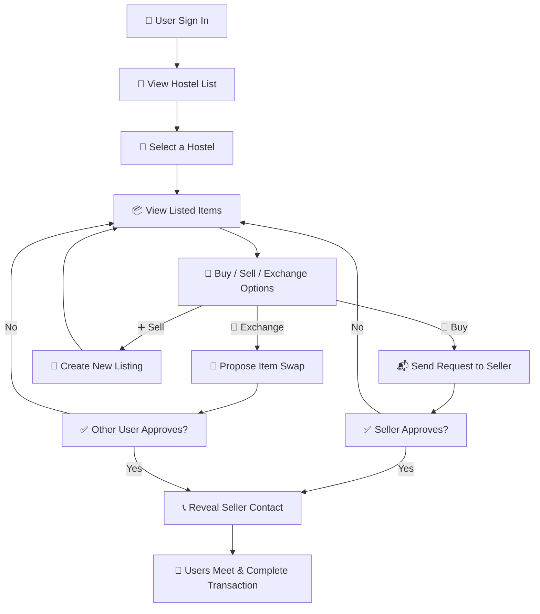

# 🎓 Campus Market

**Campus Market** is your one-stop marketplace made **by students, for students** — where college students can **buy, sell, or exchange** items like lab coats, calculators, books, snacks, and more.

🛍️ Think OLX meets your campus hostel — optimized for student life.  
🌙 Automatically opens to **Night Market** (hostel-only listings) at night.  
🕶️ Always in slick dark mode. No payments, just connections.

---

## 🚀 Features

- 🔐 **Google Sign-In with college email** (`@college.edu`) required for sellers
- 📦 List your unused items for sale or exchange
- 🛒 Browse items posted by others
- 📬 Send buy requests → Seller approves → Deal offline
- 🌃 **Night Market** mode for hostel-level selling (chips, Maggi, etc.)
- 🌓 Smart tab-based switch between **Day Market** (college-wide) and **Night Market**
- 🖼️ Dark mode UI with neon highlights

---

## 🧑‍💻 Tech Stack

| Layer       | Tech Used |
|-------------|-----------|
| Frontend    | Vite + React + Tailwind CSS |
| Backend     | FastAPI |
| Auth        | FireBase Authentication (Google OAuth + PhoneAuth) |
| Database    | PostgreSQL (via Supabase) |
| Hosting     | Vercel (Frontend) + Railway (Backend) |

---

## 🛠️ Project Structure

```
campus-market/
├── client/                 # React (Vite + Tailwind)
│   ├── components/
│   ├── pages/
│   └── assets/
│
├── server/                 # FastAPI Backend
│   ├── routes/
│   ├── models/
│   └── database/
│
└── README.md
```

---

## 🛣️ Roadmap

### ✅ Phase 1: MVP (within 15 days)
- [x] Google Sign-In (only `@college.edu` for sellers)
- [x] Item listing + Explore marketplace
- [x] Buy request → seller approval → show contact
- [x] Manual mark as sold
- [x] Hosted frontend + backend

### 🌓 Phase 2: Smart Day/Night Tabs
- [ ] Auto switch between Day and Night market based on time
- [ ] Night listings restricted to selected hostel
- [ ] Explore UI filters (hostel, category, etc.)

### 💬 Phase 3: In-App Bargaining (Future)
- [ ] Simple in-app chat
- [ ] Offer → Counter → Accept flow

---

## 📊 User Flow



---

## 🧠 Important Notes

* 💡 **Only** `@college.edu` emails can list items (auth-verified)
* 🆓 Freshers *without* college email can still browse and buy
* 🧾 No payments handled on platform – buyers & sellers connect offline
* 🧼 Sellers manually mark listings as *sold*

---

## 🤝 Contributing

Want to improve Campus Market? Submit issues, ideas, or pull requests — we're all students here 🚀

```bash
git clone https://github.com/Aayush-Bindal/CampusMarketplace
```

---

## 📣 Credits

Built with ☕, 🔥, and a dream to stop wasting lab coats  
feel free to reach out!

---

## 📜 License

MIT License © 2025 Campus Market
